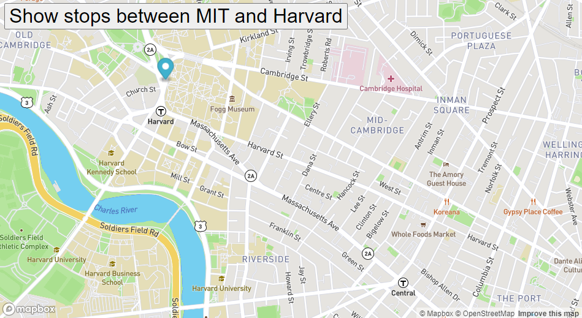

# real-time-bus-tracking-project

## Description
This project is an excersie for This project is part of MIT Professional Certificate in Coding: Full Stack Development with MERN - week 9,it is a map API display the live location of the buses of the Boston MBTA buses.
it builds using Javascript, HTML, and CSS.

## How to Run
Download the project and run the index.html using browser.

## Future Improvements
Add more cities that that user can see the buses stop at each city.

## Support
github : thisisraghad

## License
MIT
